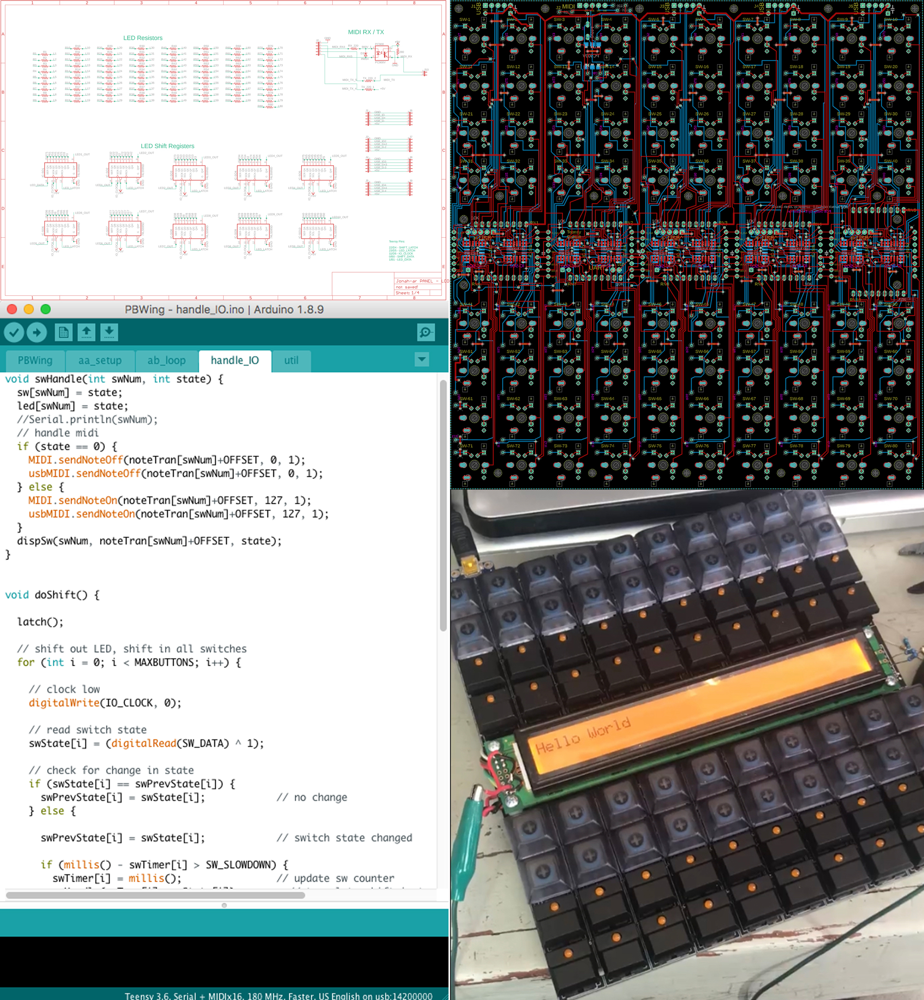
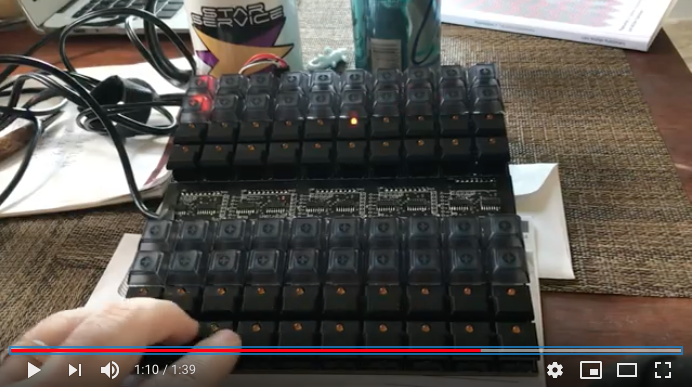
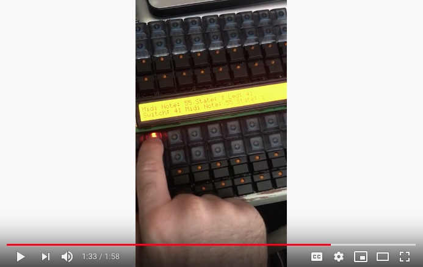

# Playback-Wing
Concept by Survivor Sound (http://www.survivorsound.com/)

Proof of concept prototype developed by Eric Bateman in 2018

 
MIDI DEMO VIDEO (with cat at the end)

 
LCD DEMO VIDEO

Playback Wing is a portable MIDI powered lighting controller with LCD, meant for use with GrandMA lighting consoles.  

Features:
* Super thick (3/16") PCB, takes any abuse you can throw at it
* PCB uses a custom switch footprint that can accomodate either CherryMX or 5500 series switches, with or without LEDs. Create your own layout! 
* USB and hardware DIN MIDI
* Optional LCD 
